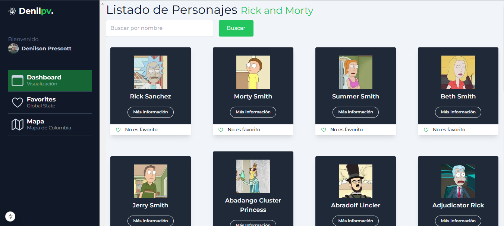

# Rick and Morty API Explorer

Este proyecto es una aplicación creada con **Next.js** que permite explorar la API de **Rick and Morty**. Utiliza estados globales con **Redux**, almacenamiento en el navegador con **localStorage**, **Tailwind CSS** para el diseño y **Axios** para las peticiones HTTP.

## Características

- Consulta datos de personajes, ubicaciones y episodios de la API de Rick and Morty.
- Gestión de estados globales mediante Redux.
- Persistencia de datos en localStorage.
- Diseño responsivo y moderno con Tailwind CSS.
- Peticiones HTTP optimizadas con Axios.

## Requisitos Previos

Asegúrate de tener instalado:

- [Node.js](https://nodejs.org/) (versión 16 o superior)
- [npm](https://www.npmjs.com/) o [yarn](https://yarnpkg.com/)



## Instalación

1. Clona este repositorio:

   ```bash
   git clone https://github.com/Denilpv08/prueba-tecnica-nextjs.git

   npm install

   cd prueba-tecnica-nextjs

   npm run dev
   ```
